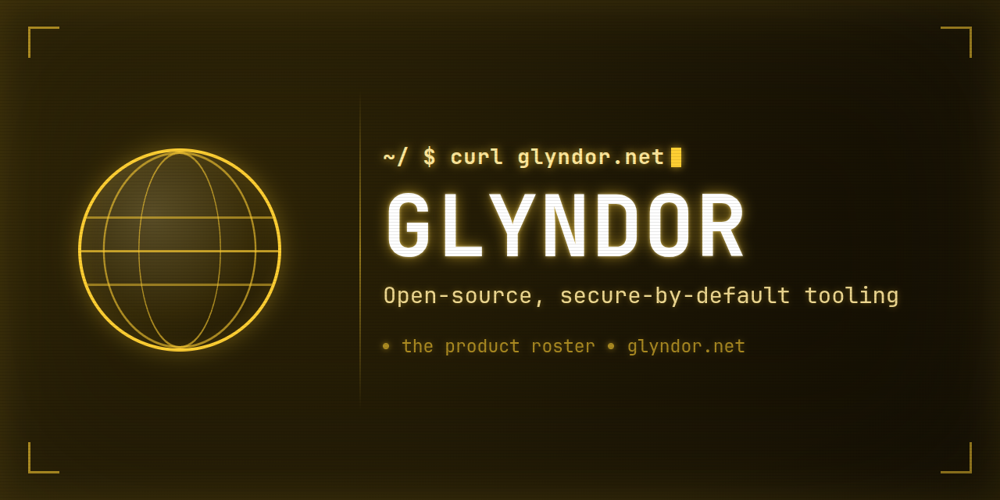

<p align="center">
  
</p>

# Glyndor Scoop bucket

Scoop manifests for Glyndor's Windows binaries. The Windows counterpart to the
signed apt repository at [apt.glyndor.net](https://apt.glyndor.net) (Linux) and
the [Homebrew tap](https://github.com/Glyndor/homebrew-tap) (macOS).

## Install

```powershell
scoop bucket add glyndor https://github.com/Glyndor/scoop-bucket
scoop install podup
```

`scoop` reads this repository directly from GitHub — there is no separate server
or domain to trust. Each manifest pins the exact SHA-256 of the release binary it
installs, so Scoop refuses a download whose bytes don't match.

Upgrades come with `scoop update podup` once a new release is published (below).

## Available manifests

| Manifest | Product |
|---|---|
| `podup` | docker-compose translator and runner for rootless Podman |

## How it stays current

Nothing is pushed into this repository from a product. A workflow here
(`.github/workflows/update.yml`) runs daily and on demand, mirroring the apt
repository's pull model:

1. Read each product's latest GitHub release.
2. Download its `SHA256SUMS` and `SHA256SUMS.sig` and **verify the signature
   against the org's Ed25519 release key** — the same key the products embed.
3. Re-render `bucket/*.json` with the verified version, URLs and checksums.
4. Open an auto-merging pull request when a manifest changes.

So the hash a manifest ships is one taken from a signature-verified manifest, not
from whatever an unverified release asset happened to contain — and no product
needs a write credential on this repository.

`bucket/*.json` is generated by `scripts/render-manifests.sh`; edit the
generator, never the manifests by hand.
