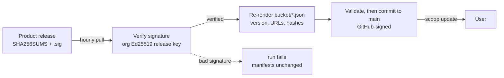

<div align="center">

# Glyndor Scoop bucket

**Scoop manifests for Glyndor's Windows binaries.**
The Windows counterpart to [apt.glyndor.net](https://apt.glyndor.net) (Linux)
and the [Homebrew tap](https://github.com/Glyndor/homebrew-tap) (macOS).

[](https://github.com/Glyndor/scoop-bucket/actions/workflows/tests.yml)
[](https://github.com/Glyndor/scoop-bucket/actions/workflows/update.yml)

</div>

## Install

```powershell
scoop install git
scoop bucket add glyndor https://github.com/Glyndor/scoop-bucket
scoop install podup
```

A bucket is a git clone, so Scoop refuses to add one without git. Skip the
first line if you already have it.

| Package | What it is | On Windows |
| --- | --- | --- |
| [`podup`](https://github.com/Glyndor/podup) | Docker-compose translator and runner for rootless Podman | this bucket |
| [`epistle`](https://github.com/Glyndor/epistle) | Self-hosted headless mail server: SMTP, IMAP | not built |
| [`helmly-agent`](https://github.com/Glyndor/helmly-agent) | Hardened server agent for the Glyndor panel: signed commands over WireGuard and mTLS | not built |

## Upgrades

```powershell
scoop update
scoop update podup
```

The first line re-syncs the bucket clone. On its own, `scoop update podup`
compares against the copy on disk and reports the version you already have as
the latest one, until Scoop next refreshes the bucket by itself.

## What you are trusting

**The checksum in each manifest does not come from the release asset.** It
comes from a `SHA256SUMS` this repository verified against the organisation's
Ed25519 release key first, the same key the products embed.

`scoop` reads this repository straight from GitHub, so there is no separate
server in the path, and a download whose bytes do not match the pinned SHA-256
is refused.


```mermaid
flowchart LR
  R["Product release<br/>SHA256SUMS + .sig"] -->|hourly pull| V["Verify signature<br/>org Ed25519 release key"]
  V -->|verified| G["Re-render bucket/*.json<br/>version, URLs, hashes"]
  G --> C["Validate, then commit to main<br/>GitHub-signed"]
  C -->|scoop update| U["User"]
  V -.->|bad signature| X["run fails<br/>manifests unchanged"]
```

Nothing is pushed here from a product, and no product holds a write
credential on this repository. A bad signature fails the run and leaves the
manifests untouched, so the failure mode is a bucket that stops updating, never
one that ships an unverified binary.

---

See [CONTRIBUTING.md](CONTRIBUTING.md). Report a problem via the
[Security](https://github.com/Glyndor/scoop-bucket/security) tab.
[MIT](LICENSE).
